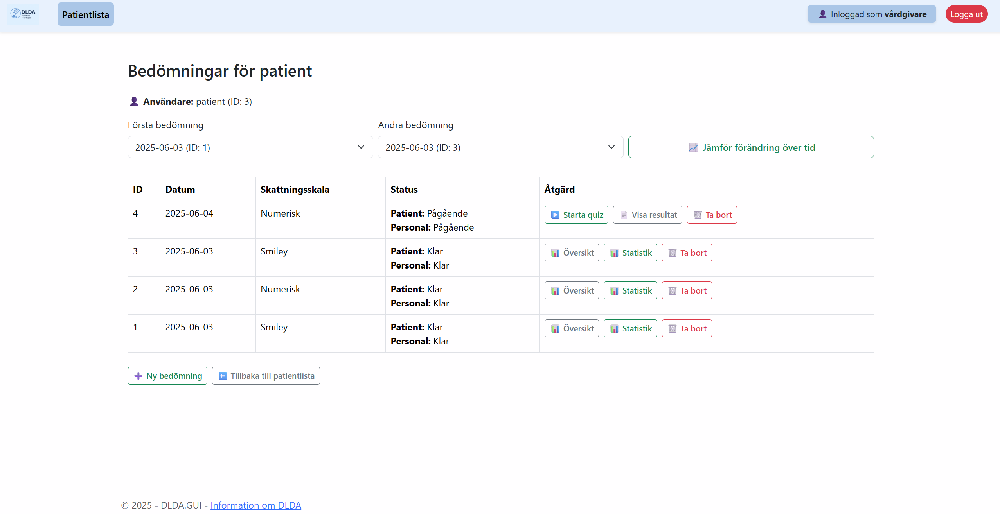
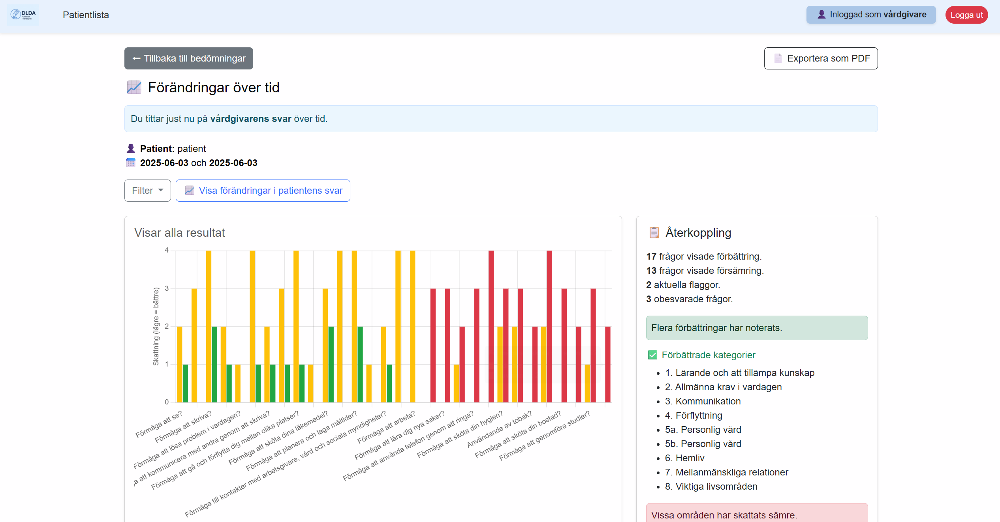
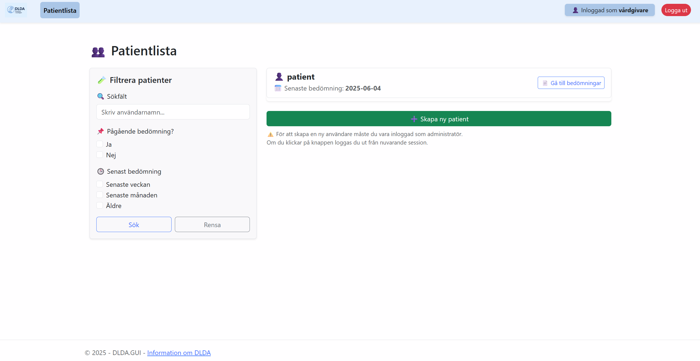
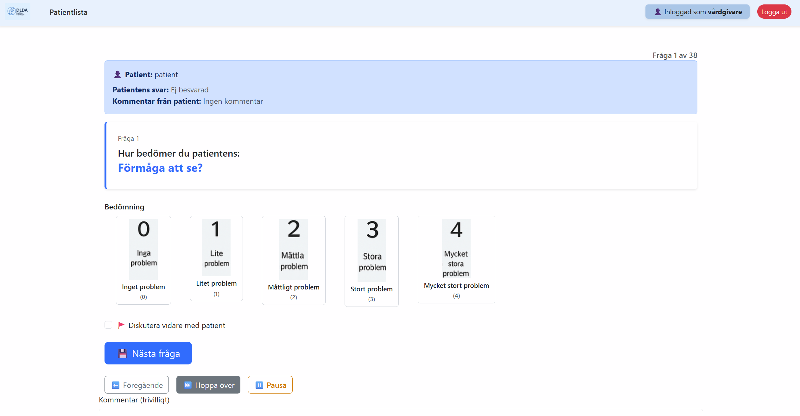
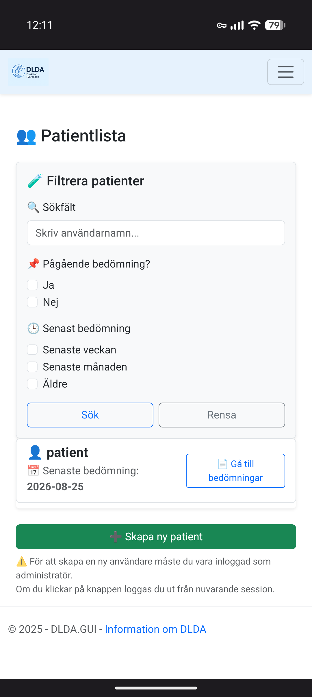
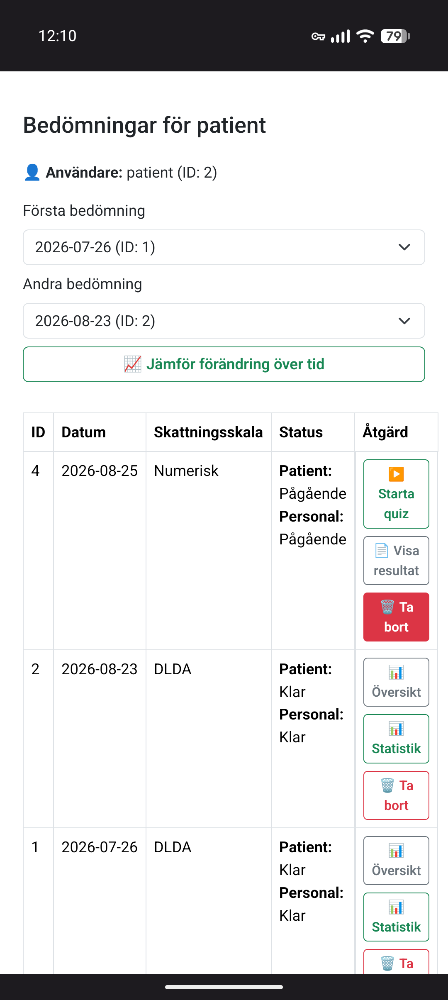
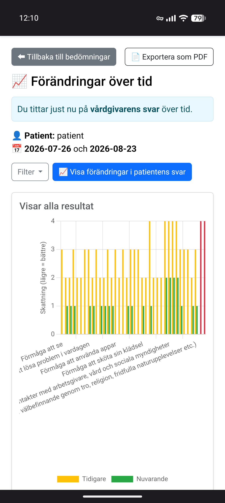
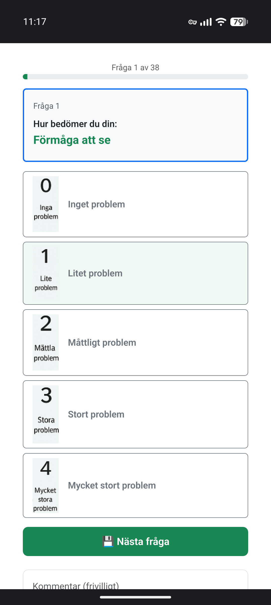
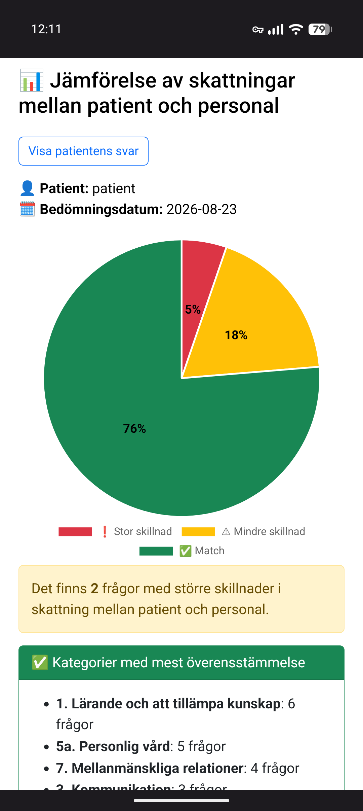

[](https://dotnet.microsoft.com/)
[](https://www.docker.com/)
[](https://dotnet.microsoft.com/apps/aspnet)
[](https://learn.microsoft.com/en-us/ef/core/)
[](https://github.com/BcryptNet/bcrypt.net)

# 🌐 Projekt DLDA Offline

## 📝 Introduktion

**DLDA Offline** är en webbaserad prototyp som digitaliserar det psykiatriska skattningsverktyget **DLDA (Daily Life Dialogue Assessment in Psychiatric Care)**.

Projektet består av en ASP.NET Core MVC-applikation och ett separat Web API som tillsammans hanterar användargränssnitt, autentisering, skattningar och datahantering. Systemet använder Entity Framework Core och SQL Server för lagring och körs i en Docker-baserad miljö.

Målet är att göra skattningen enklare att genomföra digitalt och samtidigt ge vårdpersonal möjlighet att följa resultat, jämföra skattningar och se förändringar över tid.

---

## 🎬 Demo

[Screencast_20260825_122507.webm](https://github.com/user-attachments/assets/e1e9070c-7691-4007-aa5d-4db576f3f531)

---

## 🖼️ Skärmbilder

### 💻 Webbgränssnitt (Desktop)

**DLDA – Bedömning för patient**  


**DLDA – Förändring över tid**  


**DLDA – Patientöversikt**  


**DLDA – Quiz-gränssnitt**  


### 📱 Responsiv design (Mobilvy)

Gränssnittet är anpassat för att vårdpersonal och patienter ska kunna använda systemet på både mobil och desktop.

| Översikt | Bedömning | Förändring | Quiz | Jämförelse |
| :---: | :---: | :---: | :---: | :---: |
|  |  |  |  |  |

---

## 📋 Innehåll

- [Vad är DLDA?](#vad-är-dlda)
- [Syfte](#-syfte)
- [Begränsningar](#️-begränsningar)
- [Projektstruktur](#-projektstruktur)
- [Mappstruktur](#-mappstruktur)
- [Kom igång (Build & Run)](#-kom-igång-build--run)
- [Användarroller & Säkerhet](#-användarroller--säkerhet)
- [Funktioner](#️-funktioner)
- [Arkitektur](#-arkitektur)
- [Tekniska koncept som används](#-tekniska-koncept-som-används)
- [Projektgrupp & Kontext](#-projektgrupp--kontext)
- [AI-assistans](#-ai-assistans)

---

## Vad är DLDA?

**DLDA (Daily Life Dialogue Assessment in Psychiatric Care)** är ett bedömningsverktyg som bygger på Världshälsoorganisationens (WHO) ICF-klassifikation. Verktyget används inom psykiatrin för att tillsammans med patienten och vårdpersonalen få en bild av hur olika delar av patientens vardag fungerar.

Bedömningen består av frågor inom nio områden, bland annat personlig vård, kommunikation, hemliv och relationer. Både patienten och vårdpersonalen gör en egen skattning på en skala från **0 till 4**, där 0 innebär inget problem och 4 innebär ett mycket stort problem.

Resultaten kan sedan användas som underlag för samtal mellan patient och vårdpersonal, exempelvis kring behov, stöd och fortsatt vård.

---

## 🎯 Syfte

Syftet med projektet är att undersöka hur DLDA skulle kunna fungera i en digital miljö istället för på papper.

Tanken är att göra det enklare för patienten att genomföra sin skattning och samtidigt ge vårdpersonalen en tydligare överblick över resultaten. Systemet gör det bland annat möjligt att jämföra patientens och personalens skattningar, visualisera resultat och följa förändringar över tid.

---

## ⚠️ Begränsningar

Projektet är en prototyp som har utvecklats i utbildningssyfte och är inte avsett att användas som ett färdigt kliniskt vårdsystem.

Funktioner, säkerhet och datalagring är anpassade efter projektets tekniska förutsättningar. Projektet ska därför inte användas för att hantera riktiga patientuppgifter eller användas i klinisk verksamhet.

---

## 📁 Projektstruktur

Lösningen är uppdelad i två samverkande huvudprojekt:

| Projekt | Typ | Syfte |
|:---|:---|:---|
| **DLDA.API** | Web API | Hanterar affärslogik, databasåtkomst via EF Core, autentisering och API-endpoints. |
| **DLDA.GUI** | MVC Web App | Webbgränssnitt som kommunicerar med API:et och hanterar användarflöden och sessioner. |

Projektet kan köras på två olika sätt beroende på användningsområde:

- **Docker Compose** används för att köra projektets olika delar som en samlad miljö.
- **DevContainers** används som utvecklingsmiljö för respektive projekt. Både `DLDA.API` och `DLDA.GUI` har egna DevContainer-konfigurationer, vilket gör det möjligt att utveckla i isolerade och reproducerbara miljöer.

---

## 🧱 Mappstruktur

```text
Projekt-DLDA-Offline/
├─ DLDA.API/
│  ├─ .devcontainer/           # Konfiguration för Docker-utvecklingsmiljö
│  ├─ Controllers/             # API-endpoints (Assessment, Auth, User, m.fl.)
│  ├─ Data/                    # AppDbContext för SQL Server-koppling
│  ├─ DTOs/                    # Data Transfer Objects för dataöverföring
│  └─ Models/                  # Datamodeller (User, Question, Assessment)
├─ DLDA.GUI/
│  ├─ .devcontainer/           # Konfiguration för Docker-utvecklingsmiljö
│  ├─ Authorization/           # RoleAuthorizeAttribute för RBAC-logik
│  ├─ Controllers/             # MVC-logik för Patient, Staff och Admin
│  ├─ Services/                # API-klienter (AccountService, QuizService, etc.)
│  ├─ Views/                   # Razor-vyer (HTML/C#)
│  └─ wwwroot/                 # CSS, JS och bilder
└─ docker-compose.yml          # Docker Compose-konfiguration
```

---

## 🚀 Kom igång (Build & Run)

Projektet kan köras på två sätt:

- **Docker Compose** – för att köra projektets olika delar som en samlad miljö.
- **DevContainers** – för utveckling i separata och reproducerbara utvecklingsmiljöer.

### Förutsättningar

- Docker Desktop
- JetBrains Rider (rekommenderas) eller Visual Studio Code
- SQL Server

### 🐳 Alternativ 1 – Docker Compose

1. Klona arkivet till din lokala maskin.
2. Kontrollera att SQL Server är tillgänglig och att anslutningssträngen är korrekt konfigurerad.
3. Starta projektet med Docker Compose:

```bash
docker compose up --build
```

4. När containrarna har startat kan applikationen nås via de portar som anges i `docker-compose.yml`.

> Kontrollera `docker-compose.yml` för aktuella portar och miljövariabler.

### 🛠️ Alternativ 2 – DevContainers

Projektet innehåller separata DevContainer-konfigurationer för `DLDA.API` och `DLDA.GUI`.

#### Starta API

1. Öppna mappen `DLDA.API` i Rider eller Visual Studio Code.
2. Välj **Reopen in Container** / **Start DevContainer**.
3. Kontrollera anslutningssträngen i:

```text
DLDA.API/appsettings.json
```

4. Kontrollera att `ConnectionStrings` pekar mot rätt SQL Server-instans.
5. Kör API-projektet.

API:et och Swagger startar på:

```text
http://localhost:5001/swagger
```

#### Starta GUI

1. Öppna mappen `DLDA.GUI` i en separat fönsterinstans.
2. Välj **Reopen in Container** / **Start DevContainer**.
3. Kör GUI-projektet.

Webbapplikationen startar på:

```text
http://localhost:5000
```

### Skapa testdata

När API:et är igång kan Swagger användas för att skapa grundläggande testdata.

Följande utvecklings-endpoints kan användas:

```text
POST /api/Auth/dev-update-admin
POST /api/Auth/dev-seed-questions
POST /api/Auth/dev-seed-users
```

Endpoints används för att bland annat skapa en administratör, lägga in skattningsfrågor samt skapa testpatient och testpersonal.

> **Obs:** Dessa endpoints är avsedda för utvecklingsmiljön och bör inte exponeras i en produktionsmiljö.

---

## 🔐 Användarroller & Säkerhet

Projektet använder rollbaserad åtkomst för att skilja mellan olika typer av användare.

### Roller

- **Admin** – Hanterar användare och skattningsfrågor.
- **Staff** – Kan arbeta med patienter och följa deras skattningar.
- **Patient** – Kan genomföra sina egna skattningar.

### Säkerhetslösningar

- **RBAC (Role-Based Access Control)**  
  En anpassad `RoleAuthorizeAttribute` styr åtkomst baserat på användarens roll:
  - Admin
  - Staff
  - Patient

- **Lösenordssäkerhet**  
  Använder **BCrypt.Net** för hashing och verifiering av lösenord.

- **Session State**  
  Användar-ID och roll används i sessionen för att hantera den inloggade användaren.

- **CORS-policy**  
  API:et är konfigurerat för att begränsa vilka klienter som får kommunicera med API:et.

---

## ⚙️ Funktioner

- **Inloggningssystem** – Autentisering och rollhantering.
- **Digitala formulär** – Interaktiva skattningsformulär för DLDA.
- **Patientöversikt** – Personal kan se och följa patienters resultat.
- **Statistik och uppföljning** – Visualisering av förändringar över tid.
- **Jämförelse mellan patient och personal** – Visar skillnader mellan skattningar.
- **Administrationspanel** – Hantering av användare och frågor (CRUD).
- **Responsiv design** – Anpassat för både mobil och desktop.

---

## 🧱 Arkitektur

Projektet består av en separat MVC-applikation och ett Web API.

```text
┌─────────────────┐
│    DLDA.GUI     │
│   ASP.NET MVC   │
└────────┬────────┘
         │
         │ HTTP
         ▼
┌─────────────────┐
│    DLDA.API     │
│  ASP.NET Core   │
└────────┬────────┘
         │
         │ EF Core
         ▼
┌─────────────────┐
│    SQL Server   │
└─────────────────┘
```

- **DLDA.GUI** – Ansvarar för presentation, användarflöden och kommunikation med API:et.
- **DLDA.API** – Ansvarar för API-endpoints, autentisering, affärslogik och databaskommunikation.
- **SQL Server** – Används för lagring av användare, frågor och skattningsresultat.

Kommunikationen mellan GUI och API sker via `HttpClient`. Dataåtkomst i API:et hanteras med Entity Framework Core.

---

## 🧩 Tekniska koncept som används

| Område | Implementation | Förklaring |
|:---|:---|:---|
| **Framework** | .NET 9 / ASP.NET Core | Grund för API och webbapplikation |
| **Frontend** | ASP.NET Core MVC / Razor | Webbgränssnitt och användarflöden |
| **Backend** | ASP.NET Core Web API | API och backendlogik |
| **Development Environment** | Docker / DevContainers | Isolerade och reproducerbara utvecklingsmiljöer |
| **Security** | RBAC & BCrypt | Hanterar roller och lösenord |
| **API Communication** | HttpClient | Kommunikation mellan GUI och API |
| **Data Access** | EF Core / SQL Server | ORM och databashantering |
| **API Documentation** | Swagger | Dokumentation och testning av API-endpoints |
| **Architecture** | MVC + API | Separation mellan presentation och backend |

---

## 👥 Projektgrupp & Kontext

Detta projekt utvecklades som en del av kursen:

**Projektarbete och projektmetodik (7,5 hp)**  
(*Work and Project Methodology, 7.5 credits*)

Projektet genomfördes i en grupp om sju studenter där vi tillsammans planerade, utvecklade och levererade en fungerande prototyp.

### 👨‍💻 Min roll

Jag hade rollen som **projektledare och backendutvecklare**.

Som projektledare ansvarade jag bland annat för:

- Tolkning av projektdirektiv och planering av projektets initiala arbete.
- Fördelning av roller och uppgifter inom gruppen.
- Tidsplanering och uppföljning av projektets milstolpar.
- Kommunikation inom gruppen och kontakt med uppdragsgivare.
- Identifiering och hantering av tekniska och praktiska risker.

Som backendutvecklare arbetade jag främst med:

- Inloggning och användarroller.
- Frågestrukturer och quizflöde.
- Statistik och resultatvisning.
- Personalens bedömningsflöden.
- Databasstruktur och databaskopplingar.
- Controllers, services och DTO:er i backend.
- Tekniska vägval, felsökning och implementation.

Jag var även delaktig i framtagningen av wireframes i Figma och arbetade med tekniska lösningar för bland annat PDF-generering och användarupplevelse.

### 🎯 Fokus i projektet

Projektarbetet omfattade bland annat:

- Projektplanering och tidsplanering.
- Riskanalys och hantering av potentiella problem.
- Ansvarsfördelning och samarbete inom gruppen.
- Löpande uppföljning och iteration av lösningen.
- Dokumentation, presentation och slutleverans.

### 💡 Erfarenheter

Projektet gav praktisk erfarenhet av:

- Projektledning och arbete i utvecklingsteam.
- Utveckling med separerad frontend och backend.
- ASP.NET Core MVC och Web API.
- API-baserad kommunikation.
- Docker och DevContainers.
- Grupparbete, problemlösning och tekniska beslut.
- Att koppla tekniska lösningar till verksamhetens behov.

---

## 📜 License

Detta projekt distribueras under **MIT License**.

```text
MIT License

Copyright (c) 2025 DLDA

Permission is hereby granted, free of charge, to any person obtaining a copy
of this software and associated documentation files (the "Software"), to deal
in the Software without restriction, including without limitation the rights
to use, copy, modify, merge, publish, distribute, sublicense, and/or sell
copies of the Software, and to permit persons to whom the Software is
furnished to do so, subject to the following conditions:

The above copyright notice and this permission notice shall be included in all
copies or substantial portions of the Software.

THE SOFTWARE IS PROVIDED "AS IS", WITHOUT WARRANTY OF ANY KIND, EXPRESS OR
IMPLIED, INCLUDING BUT NOT LIMITED TO THE WARRANTIES OF MERCHANTABILITY,
FITNESS FOR A PARTICULAR PURPOSE AND NONINFRINGEMENT. IN NO EVENT SHALL THE
AUTHORS OR COPYRIGHT HOLDERS BE LIABLE FOR ANY CLAIM, DAMAGES OR OTHER
LIABILITY, WHETHER IN AN ACTION OF CONTRACT, TORT OR OTHERWISE, ARISING FROM,
OUT OF OR IN CONNECTION WITH THE SOFTWARE OR THE USE OR OTHER DEALINGS IN THE
SOFTWARE.
```

---

## 🤖 AI-assistans

AI-verktyg som **ChatGPT** och **Gemini** användes som stöd under utvecklingen, främst för idéarbete, felsökning, refaktorering och dokumentation.

AI-genererad kod granskades, anpassades och testades manuellt innan den inkluderades i projektet. Projektgruppen ansvarar för den slutliga implementationen och funktionaliteten.
